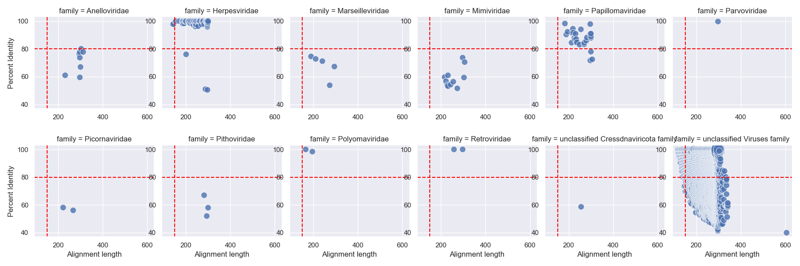

# Viral Data Analysis

All of this is derived from the [Hecatomb viral analysis](Viral Analysis.ipynb) notebook, I have abstracted it here to make it easy to review and to summarise the findings.

We used [hecatomb](https://hecatomb.readthedocs.io/) to identify the viral sequences, and then in this notebook we explore the hecatomb results.

## Assumptions

We made some assumptions, because we want to be stringent with what we are identifying. We may adjust these moving forwards.

1. We used a minimum E value of 1 x 10-20. While this is quite low, we are analysing millions of reads.
2. We only used amino acid (`aa`) alignments, and excluded the viruses only identified from nucleotide (`nt`) alignments. In particular, this eliminated all of the Adenoviridae, which is perhaps surprising.
3. We only use sequences identified as "Virus" in this analysis and exclude all other sequences. In the paper we discuss lots of other analyses of these sequences.
4. We explicitly blacklist some alignments. These are to database sequences that we have manually curated as being incorrect. Details of these are provided in the hecatomb repository.

## VMR and Metadata

We integrated data from the [ICTV Virus Metadata Resource](https://ictv.global/vmr) and we include manually curated metadata to enable comaprisons. 

# Human Viruses

The viruses are summarised in this figure:

The red dotted lines indicate 80% percent identity, and a minimum alignment length of 50 amino acids. (The x-axis is currently in base pairs).

Only alignments that appear in the top right sector are meaningful, and thus we believe that we only have significant similarities to _Herpesviridae_, _Papillomaviridae_, _Retroviridae_, and "Unclassified viruses". Note that the last group undoubtedly includes many phages.

### Retroviridae

These are similarities to hERVs and we find them in two people. We don't know whether these are actively replicating or just from the unfiltered human genome.

### Herpesviridae

17 samples from 17 pwCF out of 68 pwCF have Herpes viruses. These are shown in the figure below:

Remember that Herpes viruses 1 and 2 are Herpes Simplex, while Herpes virus 4 is EBV and we know that is widespread in the population.

### Papillomaviridae

Two of our samples have Papillomaviridae, one male and one female. We do not (currently) know their vaccine status.

# Bacterial Viruses (phages)

# Archaeal Viruses

There are only 24 sequences (out of 360,639) that map to Archaeal viruses, and they belong to 5 species and 4 families: _Saparoviridae_, _Anaerodiviridae_, _Hafunaviridae_, and _Shortaselviridae_. This is not significant enough for any detailed analysis.

# Other Viruses

## Plant viruses

There are 420 sequences that map to plants viruses, belonging to 1 species (Rice tungro bacilliform virus) and 1 families: _Caulimoviridae_

## Algal and protist viruses

There are 335 sequences that map to either algae or protist viruses, and they belong to 15 species and 4 families: _Phycodnaviridae_, _Pithoviridae_, _Mimiviridae_, and _Marseilleviridae_. These viruses might also infect macrophages since they [are other reports](https://pubmed.ncbi.nlm.nih.gov/26401040/) that they are found in [oropharyngeal samples](https://www.ncbi.nlm.nih.gov/pmc/articles/PMC4234575/).

(_Note_ in the notebook these are handled separately but I joined them here).

